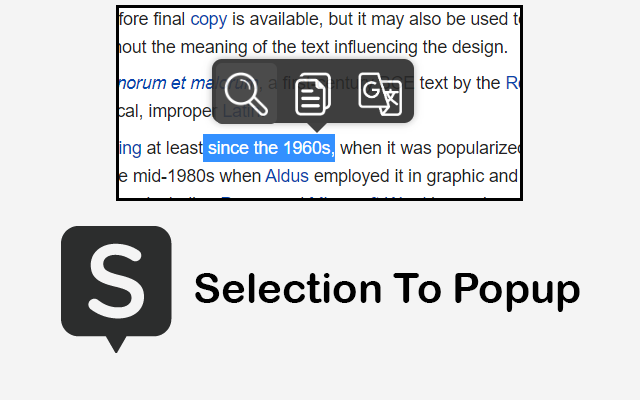

<div align="center">


# Selection to PopUp

### Highlight text on any web page and act on it instantly — Search, Copy, Translate, Define, and Convert Currency, right where you are.

No copy-pasting. No new tabs. No breaking your flow.

[](https://chromewebstore.google.com/detail/selection-to-popup/ehiiodgjjgibclbmfbiflepipnlmbkkc)
[](https://chromewebstore.google.com/detail/selection-to-popup/ehiiodgjjgibclbmfbiflepipnlmbkkc)
[](https://chromewebstore.google.com/detail/selection-to-popup/ehiiodgjjgibclbmfbiflepipnlmbkkc)
[](LICENSE)
[](https://github.com/Arif-un/Chrome-Extention--Selection-to-Pop-up)

**[⬇️ Install from the Chrome Web Store](https://chromewebstore.google.com/detail/selection-to-popup/ehiiodgjjgibclbmfbiflepipnlmbkkc)**



</div>

---

## ✨ Why Selection to PopUp?

Every day you select text to look something up — a word, a price, a phrase in
another language. Normally that means copy, open a tab, paste, wait. **Selection
to PopUp** collapses all of that into a single click. Select text and a sleek
popup appears exactly where you are, with the action you need.

Fast, private, open source, and free forever.

## 🚀 Features

- 🔍 **Search** — send the selection to your favorite search engine in one click
- 📋 **Copy** — grab text instantly with a one-tap copy
- 🌐 **Translate** — read any language inline, powered by Google Translate, no site switching
- 📖 **Dictionary** — instant definitions the moment you wonder what a word means
- 💱 **Currency Converter** — convert prices on the fly with live exchange rates
- 🛠️ **Custom Actions** — build your own buttons: open any URL, or run your own sandboxed script
- ⌨️ **Three ways to trigger** — on-selection popup, right-click **context menu**, or a **keyboard shortcut** (default `Alt+S`)
- 🎨 **Yours to tune** — pick your default action, languages, currency pair, and search engines
- ☁️ **Syncs across devices** — settings follow you through your browser account

## 🔒 Private by design

No accounts. No tracking. No analytics. We run **no servers**. Your selected text
is only sent to the service that performs the action you chose (translation,
dictionary, or currency), and **nothing is ever stored or sold**. Read the full
[Privacy Policy](PRIVACY.md).

## 📦 Install

**[Add to Chrome — Chrome Web Store](https://chromewebstore.google.com/detail/selection-to-popup/ehiiodgjjgibclbmfbiflepipnlmbkkc)**

Or load it unpacked for development (see below).

## 🧑‍💻 Develop

Built on a modern stack: **Manifest V3 · Vite 8 · Preact · TypeScript · Tailwind CSS v4**, bundled with [@crxjs/vite-plugin](https://crxjs.dev).

```bash
npm install
npm run dev        # HMR dev build in dist/
npm run build      # production build to dist/
npm run check      # format + lint + test + build
npm run zip        # build + package selection-to-popup.zip for the Web Store
```

Load `dist/` via `chrome://extensions` → **Load unpacked** (enable Developer mode).

### Architecture

- **Background service worker** — context menus, hotkey, and network requests (translate / dictionary / currency).
- **Content script** — renders the selection popup as a Preact component inside a **Shadow DOM**, so styles never leak into or out of the host page.
- **Sandbox iframe** — runs user-defined JS custom actions with no page or extension access.
- **Popup + Options** — Preact + Tailwind.

APIs: unofficial Google Translate endpoint · [freedictionaryapi.com](https://freedictionaryapi.com) · [frankfurter.dev](https://frankfurter.dev) (currency).

Releasing to the Web Store is automated — see [RELEASING.md](RELEASING.md).

## 🛠️ Custom actions

- **URL** — a template with `%s` for the selection, e.g. `https://github.com/search?q=%s`.
- **JS** — a function body with `input = { text, url, title }` in scope; `return` a string (shown inline) or an `http(s)` URL (opened). Runs sandboxed.

## ⬆️ Upgrading from v1.x

Settings from v1 (`primaryTranslate`, `primaryCurrency`, `pop_win`) migrate automatically on first run. Currencies unsupported by frankfurter.dev (e.g. BDT) fall back to the default.

## 🤝 Contributing

Contributions, issues, and feature requests are welcome. Open an
[issue](https://github.com/Arif-un/Chrome-Extention--Selection-to-Pop-up/issues)
or a pull request. If this project saves you time, please ⭐ the repo — it helps
others find it.

## 📄 License

[MIT](LICENSE) © Muhammad Arif Uddin

---

<sub>Keywords: chrome extension, select text popup, translate selected text, inline translation, dictionary lookup extension, currency converter, right-click search, text selection tools, productivity chrome extension, Manifest V3, open source.</sub>
